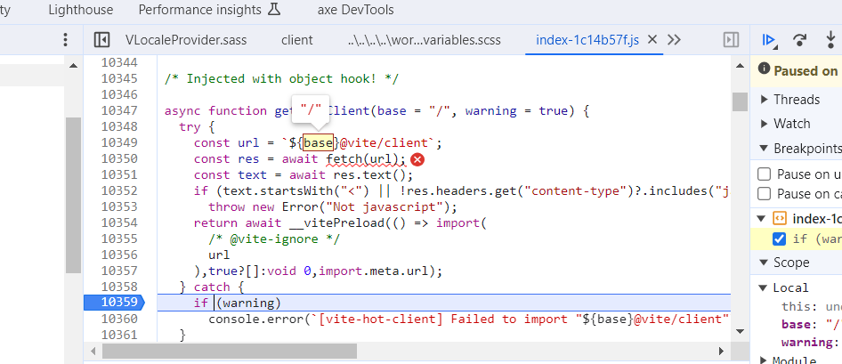
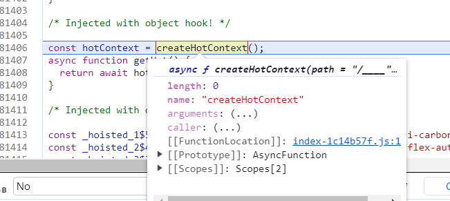

# Nuxt 3.8.1 Router Warning

This repro is about the router warning shown when using Nuxt 3.8.1 with SASS files:
```shell
[Vue Router warn]: No match found for location with path "/_nuxt/@plugin-vuetify/lib/components/VLocaleProvider/VLocaleProvider.sass".
```

There are also errors in dev tools resolving `@vite/client`, base seems to be `/` instead of `/_nuxt/` (error on page refresh on Nuxt 3.8.0 and 3.8.1 when showing Nuxt DevTools):



It seems Vite issue:



## Run Nuxt 3.8.0

To run this repro using Nuxt 3.8.0 checkout the [main branch](https://github.com/userquin/nuxt-3.8.1-router-warning/tree/main) and run
- `pnpm install`
- `pnpm nuxt prepare && pnpm dev`

## Run Nuxt 3.8.1

To run this repro using Nuxt 3.8.1 checkout the [nuxt-3.8.1 branch](https://github.com/userquin/nuxt-3.8.1-router-warning/tree/nuxt-3.8.1) and run:
- `pnpm install`
- `pnpm nuxt prepare && pnpm dev`

